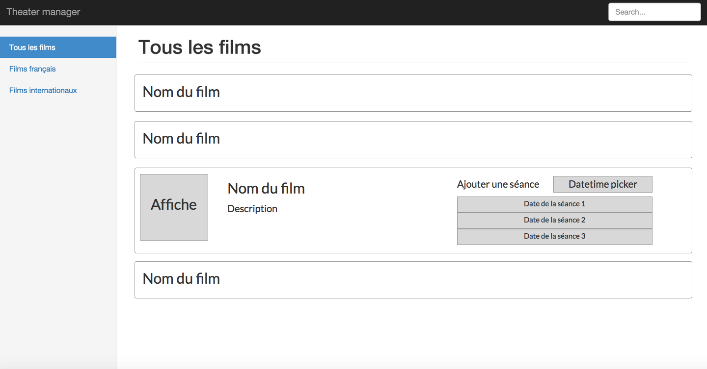

Welcome to the AngularJS skill assessment by Staffit. As you can see, this git repository contains a raw AngularJS project. During this test, you can access all your usuals work ressources : feel free to use the documentation, Stackoverflow or to google anything. The purpose of this test is to catch a glimpse of your skills in real conditions.

WHAT'S YOUR JOB ?

You work for an independant theater.
In no more than 1 hour, you will have to create a web app allowing the theater manager to see the list of the movies listed in our database. Your goal is to create the most clean and maintanable system, within the allocated time. The main following features are mandatories:

- The theater manager can see the list of the movies in the database order by their title, and can sort them by their nationality ("french" movie or "foreign" movie).
- The theater manager can search for the name of a movie by typing in a search bar.
- The theater manager can click on a movie in the list to see the detail about this movie.
- The theater manager can add a date and time of show for a movie

An other developper has already developped the service to add a show. You have to control it to debug it and add it to the project.

ABOUT THE BACK-END.

Our Back-End is made on parse.com.
The link with your index.html file is already done, don't change the ID and the Key.
The Database is composed with two classes : "Movies" and "Shows".

"Movies" is composed of :
- "objectId"
- "Title"
- "Year"
- "Realisator"
- "Description"
- "Nationality"
They are all strings, except "Year" which is a number. 
"Nationality" can only have one of this two values : "foreign" or "french".

"Shows" is composed of :
- "objectId"
- "Movie"
- "Time"
"Time" has a type Date.
"Movie" is the objectId of the movie.

